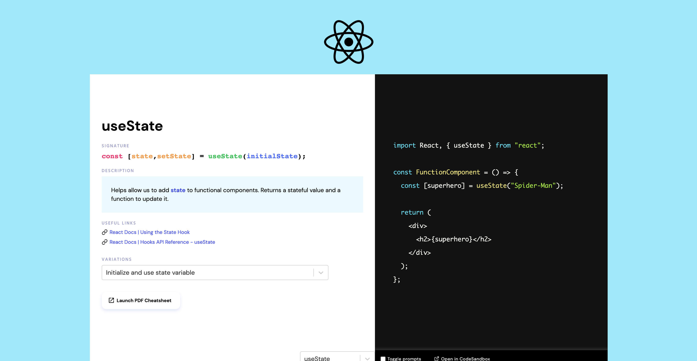

  

<h3 align="center">
  <a href="https://snippetsofhooks.dev/" target="_blank">Snippets of Hooks</a>
</h3>

  A visual directory that displays all the different ways the <a href="https://reactjs.org/docs/hooks-reference.html" target="_blank">Hooks from the core React library</a> can be used. With example code, prompts, and cheat sheets.

